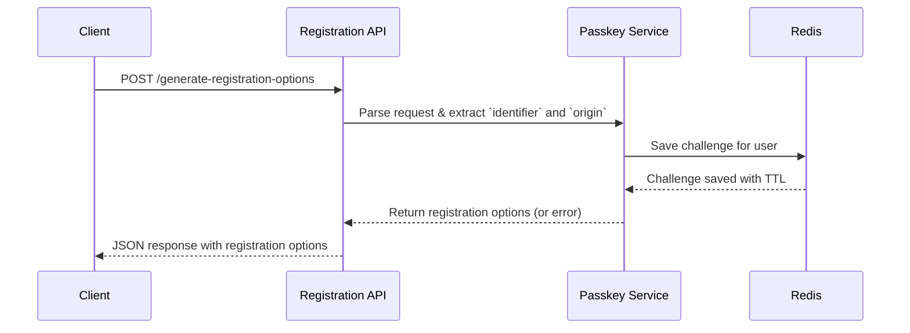
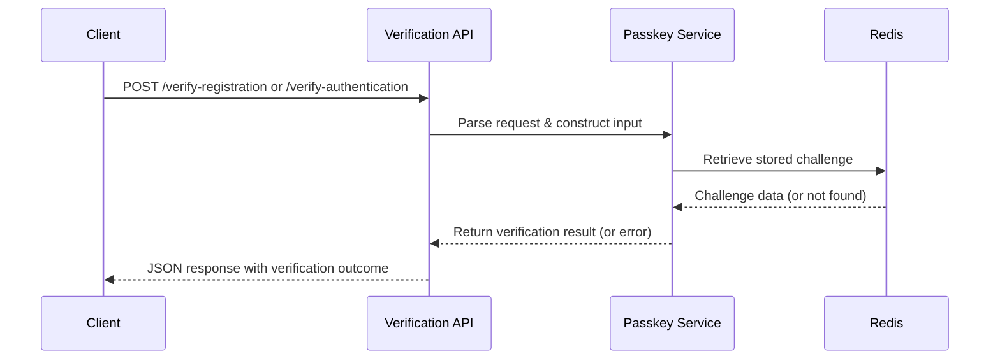

# Usage

## API Endpoints

- **Generate Registration Options:**

  `POST /api/passkey/generate-registration-options`

  - Request Body:
    ```json
    {
      "identifier": "user@example.com",
      "origin": "https://app.example.com"
    }
    ```
  - Success Response (200):

    ```json
    {
      // WebAuthn registration options
    }
    ```

  - Error Response (500):

    ```json
    {
      "error": "No matching RP ID found for the given origin"
    }
    ```

- **Verify Registration:**

  `POST /api/passkey/verify-registration`

  - Request Body:
    ```json
    {
      "identifier": "user@example.com",
      "origin": "https://app.example.com",
      "registrationResponse": {...}
    }
    ```
  - Success Response (200):

    ```json
    {
      // Verification result
    }
    ```

  - Error Response (500):

    ```json
    {
      "error": "Challenge not found"
    }
    ```

- **Generate Authentication Options:**

  `POST /api/passkey/generate-authentication-options`

  - Request Body:
    ```json
    {
      "identifier": "user@example.com",
      "origin": "https://app.example.com",
      "challenge": "optional-custom-challenge"
    }
    ```
  - Success Response (200):

    ```json
    {
      // WebAuthn authentication options
    }
    ```

  - Error Response (500):

    ```json
    {
      "error": "Authenticator not registered"
    }
    ```

- **Verify Authentication:**

  `POST /api/passkey/verify-authentication`

  - Request Body:
    ```json
    {
      "identifier": "user@example.com",
      "origin": "https://app.example.com",
      "authenticationResponse": {...}
    }
    ```
  - Success Response (200):

    ```json
    {
      // Verification result
    }
    ```

  - Error Response (500):

    ```json
    {
      "error": "Challenge not found"
    }
    ```

### Common Error Messages

- "No matching RP ID found for the given origin"
- "Challenge not found"
- "Authenticator not registered"
- "An unexpected error occurred"

## Flow

### Registration Flow (Sequence Diagram)



Summary:

1. **Request Registration Options**: The user device initiates the registration process by requesting options from the API.
2. **Return WebAuthn Registration Options**: The API responds with the necessary WebAuthn registration options.
3. **Create Registration Response**: The user device uses these options to create a registration response.
4. **Verify Registration**: The API verifies the registration response and returns the result to the user device.

### Authentication Flow (Sequence Diagram)



Summary:

1. **Request Authentication Options**: The user device requests authentication options from the API.
2. **Return WebAuthn Authentication Options**: The API provides the necessary WebAuthn authentication options.
3. **Create Authentication Response**: The user device creates an authentication response using the provided options.
4. **Verify Authentication**: The API verifies the authentication response and returns the result to the user device.

## Origin Parameter

The `origin` parameter is required in all passkey API requests and must match one of the origins specified in the `EXPECTED_ORIGIN` environment variable. This parameter helps ensure that passkey operations are only performed from authorized domains.

### Why Origin is Required

1. **Security**: The origin parameter helps prevent cross-site request forgery (CSRF) attacks by ensuring that requests come from trusted domains.
2. **WebAuthn Requirement**: The WebAuthn specification requires that the origin of the request matches the origin that was used during credential creation.
3. **Multi-tenant Support**: If your passkey service supports multiple applications, the origin helps identify which application is making the request.

### Example Usage

When making requests from a client application, always include the current origin:

```javascript
const response = await fetch(
  "https://api.example.com/api/passkey/generate-registration-options",
  {
    method: "POST",
    headers: {
      "Content-Type": "application/json",
    },
    body: JSON.stringify({
      identifier: "user@example.com",
      origin: window.location.origin, // Automatically use the current origin
    }),
  },
);
```
