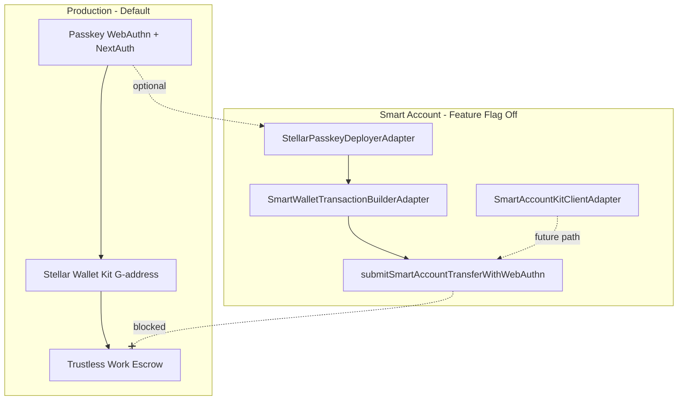

# Smart Account Module

Isolated C-address (Soroban contract) wallet implementation for KindFi. **Suspended on Mainnet production** until Trustless Work supports Smart Account Kit signing with C-addresses.

For product context (why suspended, what replaced it on Mainnet), see [`docs/smart-account-suspension.md`](../../../docs/smart-account-suspension.md).

## Architecture



## Module Map

| Concern | Location |
|---------|----------|
| Feature flag | `@packages/lib/smart-account/feature` — `isSmartAccountEnabled()` |
| Types & interfaces | `@packages/lib/smart-account/types` |
| C-address deployment | `packages/lib/src/smart-account/deployment/` |
| Client SDK wrapper | `apps/web/lib/smart-account/kit/` |
| Transaction build/sign | `apps/web/lib/smart-account/transactions/` |
| API route guard | `apps/web/lib/smart-account/guards/require-smart-account-feature.ts` |
| Trustless Work blockers | `apps/web/lib/smart-account/integrations/trustless-work.compat.ts` |
| Passkey auth (production) | `apps/web/hooks/passkey/use-passkey-auth.ts` |
| Passkey registration (production) | `apps/web/hooks/passkey/use-passkey-registration.ts` |

## Production Flow (Default)

1. User registers/signs in with **passkey** (`usePasskeyAuth`, `usePasskeyRegistration`).
2. `devices.address` stores `0x` placeholder (no C-address deployment).
3. User connects **Stellar Wallet Kit** (G-address) for escrow signing.
4. Trustless Work escrow uses `useTrustlessSigner` → `StellarWalletsKit.signTransaction`.

## Suspended Smart Account Flow (Testnet Only)

Enable with `NEXT_PUBLIC_ENABLE_SMART_ACCOUNT_CREATION=true` (**never on Mainnet production**).

1. Registration deploys C-address via `createSmartAccountDeployer()` in `verify-registration`.
2. `useStellarSorobanAccount` manages on-chain account state.
3. Transfers: `/api/stellar/transfer/prepare` → WebAuthn sign → `/api/stellar/transfer/submit`.
4. All Smart Account API routes return **403** when the flag is off.

## Trustless Work Limitation

Trustless Work does **not** support C-address / Smart Account Kit transaction signing. Production escrow **must** use G-addresses.

### Disabled Integration Points

| Location | Marker |
|----------|--------|
| `integrations/trustless-work.compat.ts` | Central blocker messages |
| `lib/utils/escrow/trustless-signer.ts` | Re-exports compat module |
| `hooks/contexts/use-stellar-wallet.context.tsx` | Rejects non-G on connect |
| `hooks/escrow/use-trustless-signer.ts` | Escrow signing facade |

Search codebase for `@smart-account-integration-point` to find all callsites.

## Dependencies

- `smart-account-kit` (optional client SDK; not on critical path today)
- KindFi auth factory: `FACTORY_CONTRACT_ID`, `CONTROLLER_CONTRACT_ID`
- `STELLAR_FUNDING_SECRET_KEY` — deploys and fee-pays transactions
- OpenZeppelin env vars (SDK path): `NEXT_PUBLIC_ACCOUNT_WASM_HASH`, `NEXT_PUBLIC_WEBAUTHN_VERIFIER_ADDRESS`
- `CHANNELS_API_KEY` — OpenZeppelin Channels relayer (server-side)

## Assumptions

- Server-side C-address deployment uses **KindFi factory contracts** (`StellarPasskeyService`), not `kit.createWallet()`.
- Transaction submit uses **manual WebAuthn auth-entry patching** in `submit-with-webauthn.service.ts`.
- `smart-account-kit` SDK is scaffolded for future migration to `signAndSubmit`.

## Re-enable Checklist

When Trustless Work adds C-address / Smart Account Kit signing support:

1. Confirm Trustless Work release notes and test on testnet.
2. Deploy auth contracts on Mainnet (`apps/contract/DEPLOYMENT_MAINNET.md`).
3. Set `NEXT_PUBLIC_ENABLE_SMART_ACCOUNT_CREATION=true` in staging/testnet first.
4. Update `integrations/trustless-work.compat.ts` to allow C-addresses for escrow.
5. Evaluate migrating signing to `SmartAccountKitClientAdapter.signAndSubmit`.
6. Run full escrow E2E on testnet with C-address.
7. Enable on Mainnet only after TW + KindFi validation complete.

## Feature Flag

```env
# Must be false (or unset) on Mainnet production
NEXT_PUBLIC_ENABLE_SMART_ACCOUNT_CREATION=false
```
