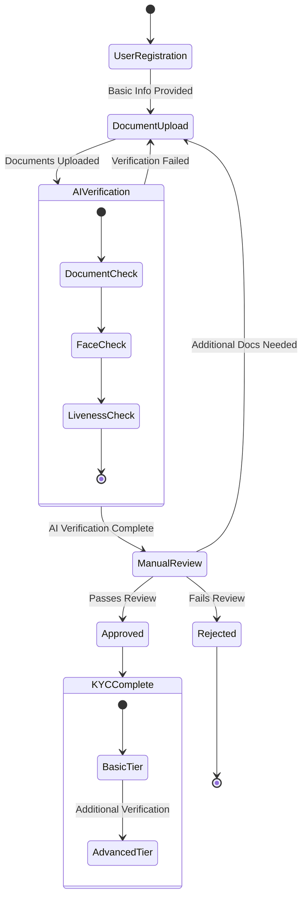
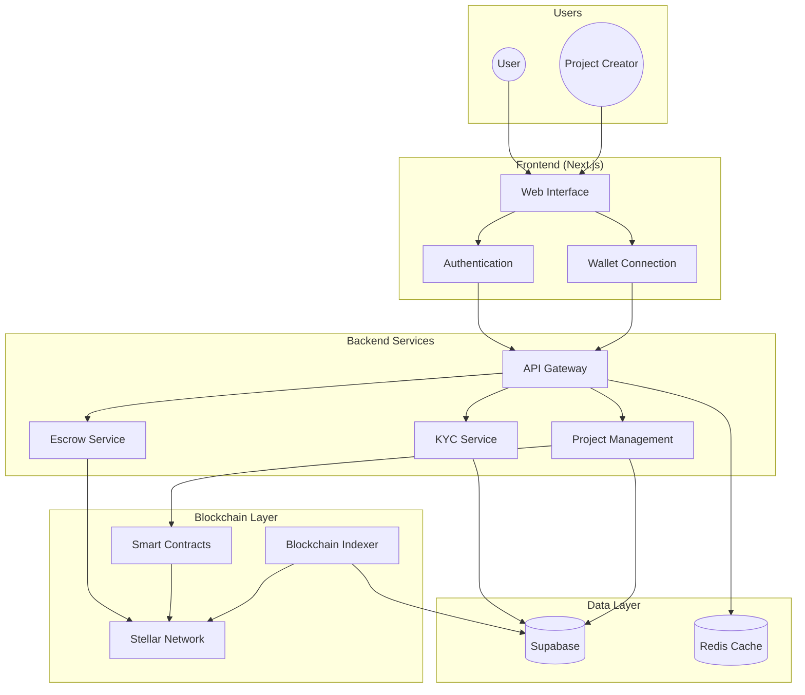
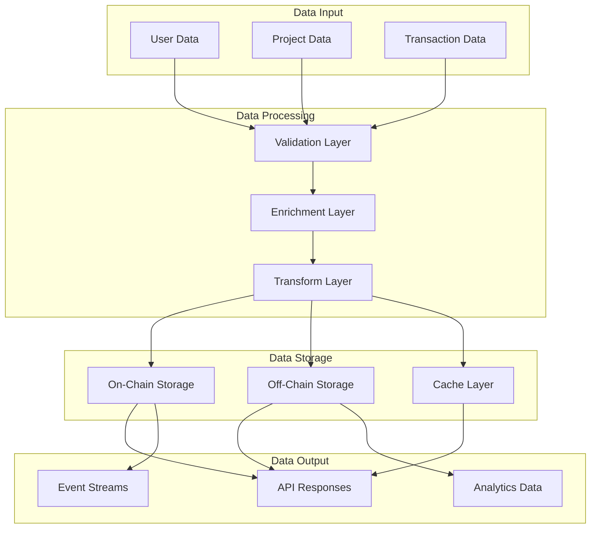
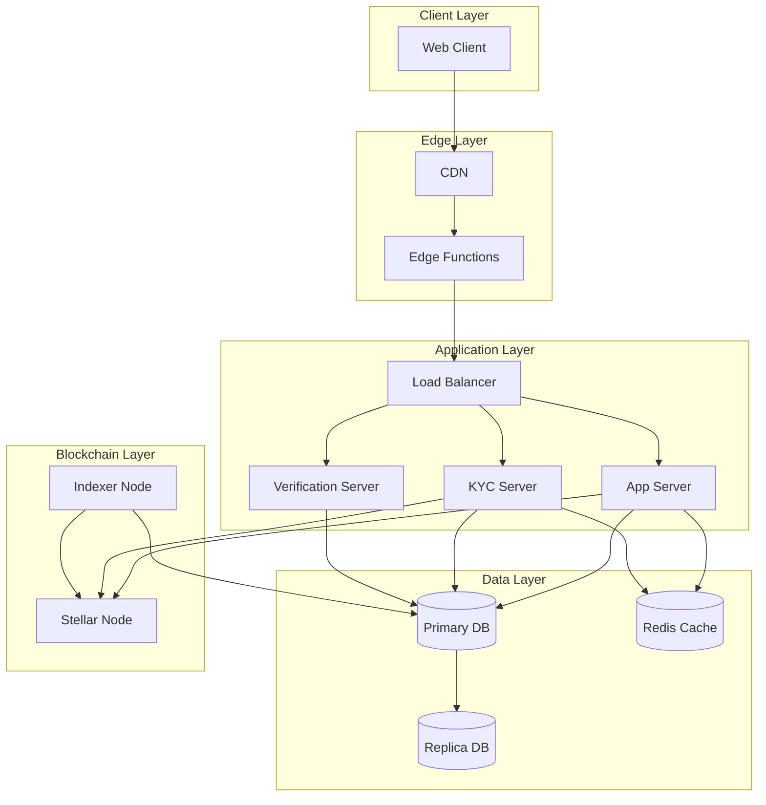

# OSS Contribution Guide - Project Architecture

Created by: Roberto "Andler" Lucas
Created time: January 7, 2025 12:17 AM
Tags: Engineering, Guides, Product

## Technology Stack

Our monorepo is a state-of-the-art technological marvel, powered by a robust and versatile stack:

**Front-end:**

- Next.js 14/15: The ultimate framework for building fast, dynamic web apps
- React with Context Hooks: Declarative UI building blocks for creating reusable, modular components
- Shadcn/ui component library: A treasure trove of beautifully crafted, ready-to-use UI components
- Tailwind CSS: The utility-first CSS framework that empowers you to build custom designs rapidly
- Lucide Icons: Delightful, pixel-perfect icons for every occasion
- Framer Motion: Bring your UI to life with buttery smooth animations

**Back-end:**

- NodeJS: The powerhouse JavaScript runtime for seamless server-side development
- Hasura or Supabase: The ultimate combo for spinning up GraphQL APIs and databases in no time
- Drizzle ORM: The TypeScript SQL query builder that makes database interactions a breeze
- GraphQL: The query language of the future for fetching exactly what you need from APIs
- GenQL: The code generation wizard for TypeScript types and GraphQL functions

**Blockchain:**

- Soroban SDK: Smart contract development toolkit for the Stellar blockchain
- Stellar Core: The backbone implementation of the Stellar protocol
- Horizon API: RESTful API server for interacting with the Stellar network
- StellarScan: Block explorer and analytics platform for transaction monitoring
- Stellar.js: JavaScript library for building Stellar-based applications
- Web3.js: Essential library for Ethereum-compatible blockchain interactions

With this incredible stack at your fingertips, you'll be empowered to build amazing applications that push the boundaries of what's possible!

## Folder Structure

Our monorepo, managed with the lightning-fast `bun` package manager, follows an intuitive and declarative folder structure:

1. `apps/`: The home for your groundbreaking server and web applications
2. `packages/`: A treasure trove of reusable packages that your apps and services can leverage
3. `services/`: The hub for integrating powerful third-party services like Supabase and DatoCMS
4. `docs/`: The knowledge base where we store enlightening markdown documents, from product updates to architectural decisions

The beauty of this structure lies in its modularity and flexibility:

- Services can seamlessly integrate packages to supercharge their functionality
- Apps can tap into the power of both packages and services to create incredible experiences
- Packages act as the building blocks, independent of specific apps or services
- Docs serve as the source of truth, generating comprehensive external documentation

## KindFi Flows

### KYC System Flow

### App Data Flow

### Server Data Flow

### Network Topology

