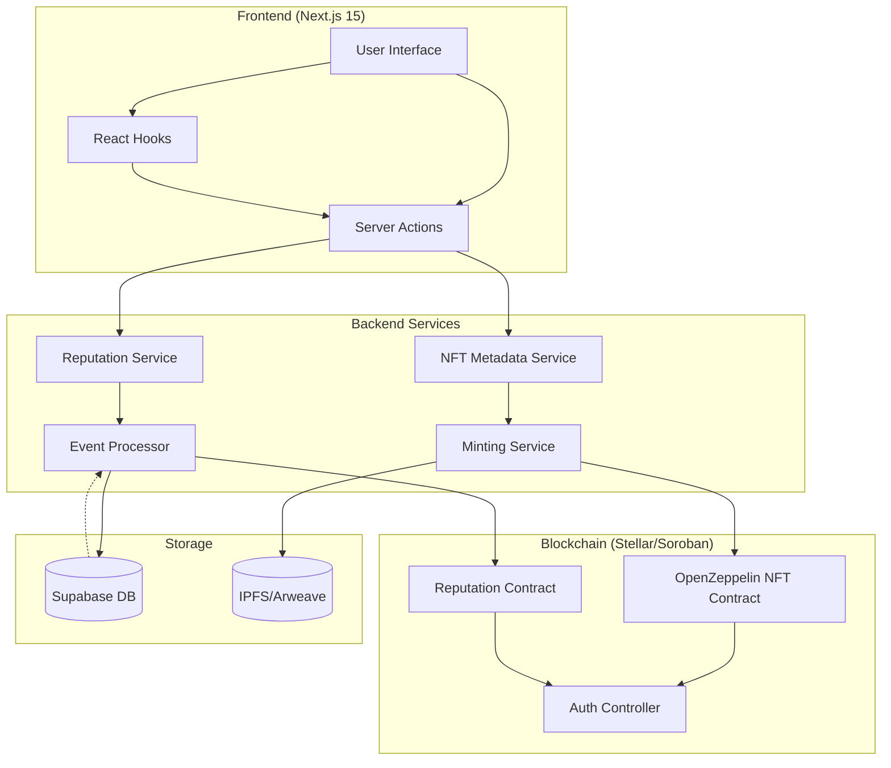
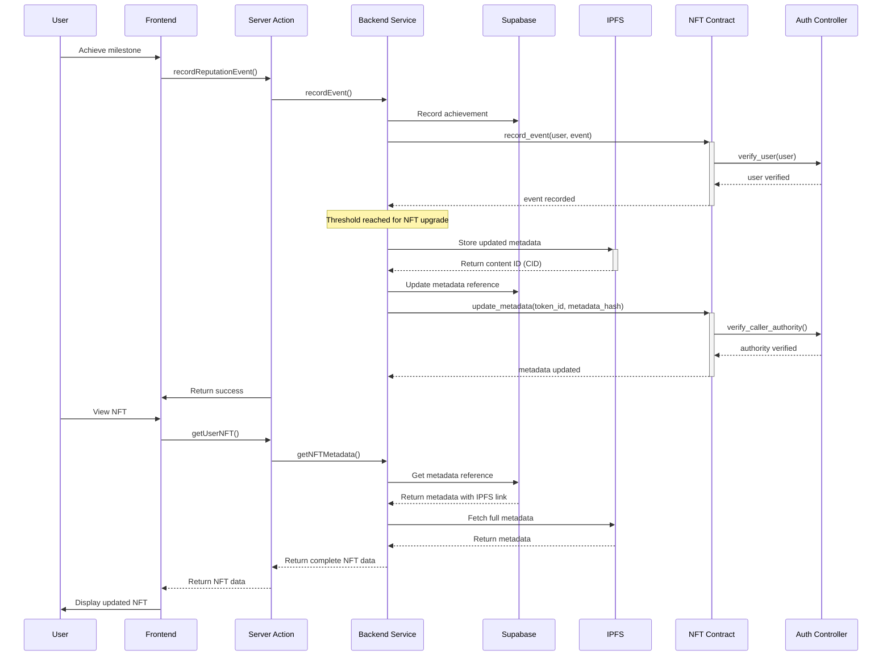

# KindFi NFT API Interfaces and Integration Points

Created by: Roberto "Andler" Lucas
Created time: April 25, 2025 2:22 AM

## Executive Summary

This document defines the NFT API interfaces and integration points for the KindFi platform, establishing a robust foundation for our reputation and incentivization system. By clearly defining these interfaces upfront, we enable parallel development across teams while maintaining architectural integrity. The NFT system serves as a cornerstone of KindFi’s gamification approach, providing (Kinder) users with evolving digital assets that reflect their contribution history and unlock progressive platform capabilities.

## 1. Architecture Overview

Our NFT architecture employs a hybrid on-chain/off-chain design that optimizes for both security and scalability:



The architecture balances on-chain immutability with off-chain flexibility:

- **On-chain components** (Soroban contracts) handle token ownership, metadata verification, and access control
- **Off-chain components** (Backend services) manage detailed metadata, 3D model references, and business logic
- **Storage layer** separates concerns between immutable records (blockchain) and rich metadata (Supabase/IPFS)

This hybrid approach enables us to deliver rich, evolving NFTs while maintaining performance and cost efficiency.

## 2. Contract Interfaces

### 2.1 OpenZeppelin-Based NFT Contract

Our NFT contract extends [OpenZeppelin’s Soroban contract](https://developers.stellar.org/docs/tools/developer-tools/openzepplin-contracts#openzeppelin-stellar-contracts-and-utilities) implementations to ensure we follow established security patterns and standards:

```rust
use soroban_sdk::{contract, contractimpl, Address, BytesN, Env, String, Vec};
use soroban_openzellin::token::{TokenClient, TokenMetadata};
use soroban_openzellin::sft::SFTClient;

// Import OpenZeppelin interfaces
use soroban_openzellin::contracts::nft::{
    NonFungibleToken, NonFungibleTokenTrait, NonFungibleTokenEvents
};

#[contract]
pub struct KindfiNFTContract;

#[contractimpl]
impl NonFungibleTokenTrait for KindfiNFTContract {
    // Implement required OpenZeppelin NFT methods
    fn name(&self, env: Env) -> String {
        String::from_slice(&env, "KindFi Kinder NFT")
    }

    fn symbol(&self, env: Env) -> String {
        String::from_slice(&env, "KINDER")
    }

    fn token_uri(&self, env: Env, token_id: u32) -> String {
        // Get URI from storage
        let storage = env.storage();
        let key = DataKey::TokenUri(token_id);
        storage.get_unchecked(key).unwrap()
    }

    fn owner_of(&self, env: Env, token_id: u32) -> Address {
        // Get owner from storage
        let storage = env.storage();
        let key = DataKey::Owner(token_id);
        storage.get_unchecked(key).unwrap()
    }

    fn transfer_from(&self, env: Env, from: Address, to: Address, token_id: u32) -> Result<(), Error> {
        // Verify caller is authorized
        self.require_auth_for_token(&env, token_id)?;

        // Transfer ownership
        let storage = env.storage();
        storage.set(DataKey::Owner(token_id), to);

        // Emit transfer event
        env.events().publish((
            Symbol::from_str("transfer"),
            from,
            to,
            token_id,
        ));

        Ok(())
    }

    // Other OpenZeppelin NFT interface implementations...
}

// KindFi-specific extension methods
#[contractimpl]
impl KindfiNFTContract {
    pub fn mint(&self, env: Env, to: Address, metadata_hash: BytesN<32>) -> Result<u32, Error> {
        // Verify caller is authorized minter
        let caller = env.invoker();
        if !self.is_authorized_minter(&env, &caller) {
            return Err(Error::Unauthorized);
        }

        // Check with AuthController
        self.authenticate_with_auth_controller(&env, Action::Mint)?;

        // Get next token ID
        let storage = env.storage();
        let next_id = storage.get(DataKey::NextTokenId).unwrap_or(0);

        // Store token data
        storage.set(DataKey::Owner(next_id), to);
        storage.set(DataKey::MetadataHash(next_id), metadata_hash);
        storage.set(DataKey::NextTokenId, next_id + 1);

        // Set initial token level
        storage.set(DataKey::TokenLevel(next_id), 1); // Start at Rookie level

        // Emit mint event
        env.events().publish((
            Symbol::from_str("mint"),
            to,
            next_id,
            metadata_hash,
        ));

        Ok(next_id)
    }

    pub fn update_metadata(&self, env: Env, token_id: u32, new_metadata_hash: BytesN<32>) -> Result<(), Error> {
        // Verify caller is authorized
        let caller = env.invoker();
        if !self.is_authorized_updater(&env, &caller) {
            return Err(Error::Unauthorized);
        }

        // Update metadata hash
        let storage = env.storage();
        storage.set(DataKey::MetadataHash(token_id), new_metadata_hash);

        // Emit update event
        env.events().publish((
            Symbol::from_str("metadata_update"),
            token_id,
            new_metadata_hash,
        ));

        Ok(())
    }

    pub fn upgrade_level(&self, env: Env, token_id: u32, new_level: u32) -> Result<(), Error> {
        // Verify caller is authorized
        let caller = env.invoker();
        if !self.is_authorized_upgrader(&env, &caller) {
            return Err(Error::Unauthorized);
        }

        // Ensure level is valid (1-5)
        if new_level < 1 || new_level > 5 {
            return Err(Error::InvalidLevel);
        }

        // Get current level
        let storage = env.storage();
        let current_level = storage.get(DataKey::TokenLevel(token_id)).unwrap_or(1);

        // Only allow level increases
        if new_level <= current_level {
            return Err(Error::InvalidLevelChange);
        }

        // Update level
        storage.set(DataKey::TokenLevel(token_id), new_level);

        // Emit upgrade event
        env.events().publish((
            Symbol::from_str("level_upgrade"),
            token_id,
            current_level,
            new_level,
        ));

        Ok(())
    }

    pub fn authenticate_with_auth_controller(&self, env: Env, action: Action) -> Result<(), Error> {
        // Get AuthController address
        let auth_controller = self.get_auth_controller_address(&env);

        // Create AuthController client
        let auth_client = AuthControllerClient::new(&env, &auth_controller);

        // Authenticate action
        let result = auth_client.authenticate(env.invoker(), action);
        if !result {
            return Err(Error::Unauthorized);
        }

        Ok(())
    }

    pub fn get_token_level(&self, env: Env, token_id: u32) -> u32 {
        let storage = env.storage();
        storage.get(DataKey::TokenLevel(token_id)).unwrap_or(1)
    }

    pub fn verify_metadata(&self, env: Env, token_id: u32, metadata_hash: BytesN<32>) -> bool {
        let storage = env.storage();
        let stored_hash = storage.get(DataKey::MetadataHash(token_id));

        if let Some(hash) = stored_hash {
            return hash == metadata_hash;
        }

        false
    }

    // Permission management methods
    fn is_authorized_minter(&self, env: &Env, address: &Address) -> bool {
        let storage = env.storage();
        storage.get(DataKey::AuthorizedMinter(*address)).unwrap_or(false)
    }

    fn is_authorized_updater(&self, env: &Env, address: &Address) -> bool {
        let storage = env.storage();
        storage.get(DataKey::AuthorizedUpdater(*address)).unwrap_or(false)
    }

    fn is_authorized_upgrader(&self, env: &Env, address: &Address) -> bool {
        let storage = env.storage();
        storage.get(DataKey::AuthorizedUpgrader(*address)).unwrap_or(false)
    }

    // Admin methods for managing permissions
    pub fn add_authorized_minter(&self, env: Env, address: Address) -> Result<(), Error> {
        // Verify caller is admin
        self.require_admin(&env)?;

        // Add minter permission
        let storage = env.storage();
        storage.set(DataKey::AuthorizedMinter(address), true);

        Ok(())
    }

    // Other permission management methods...
}
```

This contract extends OpenZeppelin’s NFT standards while adding KindFi-specific functionality for our reputation system. It integrates with our AuthController for permission verification and implements the necessary logic for NFT evolution.

### 2.2 Reputation Contract Interface

The Reputation Contract manages the on-chain component of the reputation system:

```rust
use soroban_sdk::{contract, contractimpl, Address, Env, Map, Error};
use soroban_openzellin::access::{AccessControlTrait, AccessControlClient};

#[contract]
pub struct KindfiReputationContract;

#[contractimpl]
impl KindfiReputationContract {
    // Record a new reputation event
    pub fn record_event(&self, env: Env, user: Address, event_type: EventType, points: u32) -> Result<(), Error> {
        // Verify caller is authorized
        let caller = env.invoker();
        if !self.is_authorized_recorder(&env, &caller) {
            return Err(Error::Unauthorized);
        }

        // Get current reputation
        let storage = env.storage();
        let current_points = storage.get(DataKey::ReputationPoints(user.clone())).unwrap_or(0);
        let current_level = self.calculate_level(&env, current_points);

        // Add points
        let new_points = current_points + points;
        storage.set(DataKey::ReputationPoints(user.clone()), new_points);

        // Calculate new level
        let new_level = self.calculate_level(&env, new_points);

        // Record event
        let events = storage.get::<_, Vec<ReputationEvent>>(DataKey::UserEvents(user.clone())).unwrap_or(Vec::new(&env));
        events.push_back(ReputationEvent {
            event_type,
            points,
            timestamp: env.ledger().timestamp(),
        });
        storage.set(DataKey::UserEvents(user.clone()), events);

        // Emit event
        env.events().publish((
            Symbol::from_str("reputation_event"),
            user.clone(),
            event_type,
            points,
            new_points,
        ));

        // Check if level increased
        if new_level > current_level {
            // Emit level up event
            env.events().publish((
                Symbol::from_str("level_up"),
                user,
                current_level,
                new_level,
            ));

            // Trigger NFT upgrade if available
            self.try_upgrade_nft(&env, &user, new_level)?;
        }

        Ok(())
    }

    // Get user's current reputation level
    pub fn get_level(&self, env: Env, user: Address) -> u32 {
        let storage = env.storage();
        let points = storage.get(DataKey::ReputationPoints(user)).unwrap_or(0);
        self.calculate_level(&env, points)
    }

    // Check if user meets threshold for specific permission
    pub fn meets_threshold(&self, env: Env, user: Address, threshold_type: ThresholdType) -> bool {
        let level = self.get_level(env.clone(), user);

        match threshold_type {
            ThresholdType::Voting => level >= 1, // Bronze or higher
            ThresholdType::EarlyAccess => level >= 2, // Silver or higher
            ThresholdType::ExclusiveRounds => level >= 3, // Gold or higher
            ThresholdType::SpecialRewards => level >= 4, // Diamond
        }
    }

    // Helper to calculate level from points
    fn calculate_level(&self, env: &Env, points: u32) -> u32 {
        let storage = env.storage();
        let thresholds = storage.get::<_, Map<u32, u32>>(DataKey::LevelThresholds).unwrap_or_else(|| {
            // Default thresholds if not set
            let map = Map::new(&env);
            map.set(1, 0);      // Rookie: 0 points
            map.set(2, 200);    // Bronze: 200 points
            map.set(3, 500);    // Silver: 500 points
            map.set(4, 1000);   // Gold: 1000 points
            map.set(5, 5000);   // Diamond: 5000 points
            map
        });

        // Find highest level where points >= threshold
        let mut current_level = 1;
        for level in 1..=5 {
            let threshold = thresholds.get(level).unwrap_or(u32::MAX);
            if points >= threshold {
                current_level = level;
            } else {
                break;
            }
        }

        current_level
    }

    // Try to upgrade NFT if user has one
    fn try_upgrade_nft(&self, env: &Env, user: &Address, new_level: u32) -> Result<(), Error> {
        // Get NFT contract address
        let nft_address = self.get_nft_contract_address(&env);

        // Create NFT client
        let nft_client = KindfiNFTClient::new(&env, &nft_address);

        // Get user's token ID (if any)
        let token_id = nft_client.get_token_for_user(user.clone());
        if let Some(id) = token_id {
            // Upgrade NFT level
            nft_client.upgrade_level(id, new_level)?;
        }

        Ok(())
    }

    // Admin functions
    pub fn set_level_thresholds(&self, env: Env, levels: Map<u32, u32>) -> Result<(), Error> {
        // Verify caller is admin
        self.require_admin(&env)?;

        // Validate thresholds (must be increasing)
        let mut prev = 0;
        for level in 1..=5 {
            let threshold = levels.get(level).unwrap_or(u32::MAX);
            if threshold < prev {
                return Err(Error::InvalidThresholds);
            }
            prev = threshold;
        }

        // Store thresholds
        let storage = env.storage();
        storage.set(DataKey::LevelThresholds, levels);

        Ok(())
    }

    pub fn set_event_point_values(&self, env: Env, events: Map<EventType, u32>) -> Result<(), Error> {
        // Verify caller is admin
        self.require_admin(&env)?;

        // Store point values
        let storage = env.storage();
        storage.set(DataKey::EventPointValues, events);

        Ok(())
    }

    // Permission checks
    fn is_authorized_recorder(&self, env: &Env, address: &Address) -> bool {
        let storage = env.storage();
        storage.get(DataKey::AuthorizedRecorder(*address)).unwrap_or(false)
    }

    fn require_admin(&self, env: &Env) -> Result<(), Error> {
        let caller = env.invoker();

        // Get AuthController address
        let auth_controller = self.get_auth_controller_address(&env);

        // Create AuthController client
        let auth_client = AuthControllerClient::new(&env, &auth_controller);

        // Check if caller is admin
        if !auth_client.is_admin(caller) {
            return Err(Error::Unauthorized);
        }

        Ok(())
    }

    // Configuration getters
    fn get_auth_controller_address(&self, env: &Env) -> Address {
        let storage = env.storage();
        storage.get(DataKey::AuthControllerAddress).expect("AuthController not configured")
    }

    fn get_nft_contract_address(&self, env: &Env) -> Address {
        let storage = env.storage();
        storage.get(DataKey::NFTContractAddress).expect("NFT contract not configured")
    }
}
```

This contract tracks user reputation points, calculates levels, and triggers NFT upgrades when users reach new tiers. It also provides methods to query user levels and check permission thresholds.

## 3. Backend Service Interfaces

### 3.1 Reputation Service

The Reputation Service processes events that generate reputation points and manages their persistence:

```tsx
// apps/web/app/api/reputation/service.ts
import { db } from "@/db";
import { eq } from "drizzle-orm";
import { SorobanClient } from "@/lib/soroban";
import { users, reputationEvents, achievements } from "@/db/schema";
import { AuthService } from "@/services/auth";

export class ReputationService {
  private sorobanClient: SorobanClient;
  private authService: AuthService;

  constructor() {
    this.sorobanClient = new SorobanClient();
    this.authService = new AuthService();
  }

  /**
   * Records a new reputation event for a user
   */
  async recordEvent(
    userId: string,
    eventType: string,
    data: any,
  ): Promise<{ success: boolean; points: number }> {
    // Verify user exists
    const user = await db.query.users.findFirst({
      where: eq(users.id, userId),
    });

    if (!user) {
      throw new Error(`User ${userId} not found`);
    }

    // Get point value for event type
    const pointValue = await this.getPointValueForEvent(eventType, data);

    // Insert event in database
    await db.insert(reputationEvents).values({
      userId,
      eventType,
      points: pointValue,
      metadata: data,
      createdAt: new Date(),
    });

    // Record on blockchain if significant event (points > threshold)
    if (pointValue >= 10) {
      try {
        const stellarAddress =
          await this.authService.getStellarAddressForUser(userId);
        await this.sorobanClient.callContract("reputation", "record_event", [
          stellarAddress,
          eventType,
          pointValue,
        ]);
      } catch (error) {
        console.error("Failed to record event on blockchain:", error);
        // Continue - we don't want off-chain failures to block recording
      }
    }

    // Check for achievement unlocks
    await this.checkAchievements(userId);

    return { success: true, points: pointValue };
  }

  /**
   * Get user's current reputation data
   */
  async getReputationData(userId: string): Promise<ReputationData> {
    // Get total points from database
    const events = await db.query.reputationEvents.findMany({
      where: eq(reputationEvents.userId, userId),
    });

    const totalPoints = events.reduce((sum, event) => sum + event.points, 0);

    // Get achievements
    const userAchievements = await db.query.achievements.findMany({
      where: eq(achievements.userId, userId),
    });

    // Get on-chain level
    let level = 1; // Default to Rookie
    try {
      const stellarAddress =
        await this.authService.getStellarAddressForUser(userId);
      level = await this.sorobanClient.callContract("reputation", "get_level", [
        stellarAddress,
      ]);
    } catch (error) {
      console.error("Failed to get on-chain level:", error);
      // Calculate level from points as fallback
      level = this.calculateLevelFromPoints(totalPoints);
    }

    return {
      userId,
      points: totalPoints,
      level,
      achievements: userAchievements,
      lastUpdated: new Date(),
    };
  }

  /**
   * Calculate point value for an event
   */
  private async getPointValueForEvent(
    eventType: string,
    data: any,
  ): Promise<number> {
    // Point values for different event types
    const basePoints: Record<string, number> = {
      donation: 10,
      streak_donation: 15,
      successful_referral: 20,
      new_category_donation: 15,
      new_campaign_donation: 15,
      quest_completion: 30,
      boosted_project: 25,
      outstanding_booster: 50,
    };

    let points = basePoints[eventType] || 5; // Default to 5 for unknown events

    // Apply multipliers based on event data
    if (eventType === "donation") {
      // Calculate based on donation amount
      const amount = parseFloat(data.amount);
      if (amount >= 100) {
        points *= 2; // Double points for large donations
      }
    } else if (eventType === "streak_donation") {
      // Increase points for longer streaks
      const streakLength = parseInt(data.streakLength);
      points += Math.min(streakLength * 2, 30); // Up to +30 bonus
    }

    return points;
  }

  /**
   * Check if user has unlocked any achievements
   */
  private async checkAchievements(userId: string): Promise<void> {
    const reputationData = await this.getReputationData(userId);

    // Check for level-based achievements
    if (reputationData.level >= 2) {
      await this.unlockAchievement(userId, "bronze_level");
    }
    if (reputationData.level >= 3) {
      await this.unlockAchievement(userId, "silver_level");
    }
    if (reputationData.level >= 4) {
      await this.unlockAchievement(userId, "gold_level");
    }
    if (reputationData.level >= 5) {
      await this.unlockAchievement(userId, "diamond_level");
    }

    // Check for event count achievements
    const eventCounts = await this.getEventCounts(userId);

    if (eventCounts.donation >= 10) {
      await this.unlockAchievement(userId, "donation_novice");
    }
    if (eventCounts.donation >= 50) {
      await this.unlockAchievement(userId, "donation_expert");
    }

    if (eventCounts.streak_donation >= 5) {
      await this.unlockAchievement(userId, "consistency_badge");
    }

    // More achievement checks...
  }

  /**
   * Record achievement if not already unlocked
   */
  private async unlockAchievement(
    userId: string,
    achievementType: string,
  ): Promise<void> {
    // Check if already unlocked
    const existing = await db.query.achievements.findFirst({
      where: (fields) =>
        eq(fields.userId, userId) && eq(fields.type, achievementType),
    });

    if (existing) {
      return; // Already unlocked
    }

    // Insert achievement
    await db.insert(achievements).values({
      userId,
      type: achievementType,
      unlockedAt: new Date(),
    });

    // Maybe trigger NFT update if achievement affects appearance
    if (
      ["bronze_level", "silver_level", "gold_level", "diamond_level"].includes(
        achievementType,
      )
    ) {
      const nftService = new NFTService();
      await nftService.updateNFTForAchievement(userId, achievementType);
    }
  }

  /**
   * Get counts of each event type for a user
   */
  private async getEventCounts(
    userId: string,
  ): Promise<Record<string, number>> {
    const events = await db.query.reputationEvents.findMany({
      where: eq(reputationEvents.userId, userId),
    });

    const counts: Record<string, number> = {};
    for (const event of events) {
      counts[event.eventType] = (counts[event.eventType] || 0) + 1;
    }

    return counts;
  }

  /**
   * Calculate level from points (fallback when blockchain is unavailable)
   */
  private calculateLevelFromPoints(points: number): number {
    if (points >= 5000) return 5; // Diamond
    if (points >= 1000) return 4; // Gold
    if (points >= 500) return 3; // Silver
    if (points >= 200) return 2; // Bronze
    return 1; // Rookie
  }
}
```

### 3.2 NFT Metadata Service

The NFT Metadata Service manages the off-chain metadata for NFTs:

```tsx
// apps/web/app/api/nft/service.ts
import { db } from "@/db";
import { eq } from "drizzle-orm";
import { SorobanClient } from "@/lib/soroban";
import { users, nftMetadata, nftOwnership } from "@/db/schema";
import { AuthService } from "@/services/auth";
import { IPFSService } from "@/services/ipfs";
import crypto from "crypto";

export class NFTService {
  private sorobanClient: SorobanClient;
  private authService: AuthService;
  private ipfsService: IPFSService;

  constructor() {
    this.sorobanClient = new SorobanClient();
    this.authService = new AuthService();
    this.ipfsService = new IPFSService();
  }

  /**
   * Get full metadata for an NFT
   */
  async getNFTMetadata(tokenId: string): Promise<NFTMetadata> {
    // Get basic metadata from database
    const metadata = await db.query.nftMetadata.findFirst({
      where: eq(nftMetadata.tokenId, tokenId),
    });

    if (!metadata) {
      throw new Error(`NFT metadata for token ${tokenId} not found`);
    }

    // Get additional info from blockchain
    let onChainLevel = 1;
    try {
      onChainLevel = await this.sorobanClient.callContract(
        "nft",
        "get_token_level",
        [parseInt(tokenId)],
      );
    } catch (error) {
      console.error("Failed to get on-chain level:", error);
      // Use level from database as fallback
      onChainLevel = metadata.level;
    }

    // Get IPFS content if available
    let fullMetadata: any = { ...metadata };
    if (metadata.ipfsCid) {
      try {
        const ipfsContent = await this.ipfsService.getContent(metadata.ipfsCid);
        fullMetadata = { ...fullMetadata, ...ipfsContent };
      } catch (error) {
        console.error("Failed to get IPFS content:", error);
      }
    }

    // Verify on-chain metadata hash
    const isVerified = await this.verifyMetadataHash(
      tokenId,
      metadata.metadataHash,
    );

    return {
      ...fullMetadata,
      level: onChainLevel, // Use on-chain level as source of truth
      verified: isVerified,
      lastUpdated: new Date(),
    };
  }

  /**
   * Generate NFT preview for a user
   */
  async getNFTPreview(userId: string): Promise<NFTPreview> {
    // Get user reputation data
    const reputationService = new ReputationService();
    const reputationData = await reputationService.getReputationData(userId);

    // Get user achievements
    const achievements = await db.query.achievements.findMany({
      where: eq(achievements.userId, userId),
    });

    // Determine NFT visual elements based on level
    const level = reputationData.level;
    const nftElements = this.getNFTElementsForLevel(level, achievements);

    return {
      userId,
      level,
      previewUrl: `/api/nft/render-preview?level=${level}&userId=${userId}`,
      elements: nftElements,
      achievements: achievements.map((a) => a.type),
      points: reputationData.points,
    };
  }

  /**
   * Initiate minting of NFT for user
   */
  async mintNFT(
    userId: string,
  ): Promise<{ success: boolean; tokenId: string }> {
    // Check if user already has an NFT
    const existing = await db.query.nftOwnership.findFirst({
      where: eq(nftOwnership.userId, userId),
    });

    if (existing) {
      throw new Error(
        `User ${userId} already has an NFT with token ID ${existing.tokenId}`,
      );
    }

    // Get user reputation data for initial metadata
    const reputationService = new ReputationService();
    const reputationData = await reputationService.getReputationData(userId);

    // Get user achievements
    const achievements = await db.query.achievements.findMany({
      where: eq(achievements.userId, userId),
    });

    // Create metadata
    const metadata = this.createInitialMetadata(
      userId,
      reputationData,
      achievements,
    );

    // Store metadata on IPFS
    const ipfsCid = await this.ipfsService.storeContent(metadata);

    // Generate metadata hash for on-chain verification
    const metadataHash = this.generateMetadataHash(metadata);

    // Store in database
    await db.insert(nftMetadata).values({
      ipfsCid,
      metadataHash,
      level: reputationData.level,
      userId,
      createdAt: new Date(),
      updatedAt: new Date(),
    });

    // Mint on blockchain
    try {
      const stellarAddress =
        await this.authService.getStellarAddressForUser(userId);
      const tokenId = await this.sorobanClient.callContract("nft", "mint", [
        stellarAddress,
        metadataHash,
      ]);

      // Record ownership
      await db.insert(nftOwnership).values({
        userId,
        tokenId: tokenId.toString(),
        mintedAt: new Date(),
      });

      // Update metadata with token ID
      await db
        .update(nftMetadata)
        .set({ tokenId: tokenId.toString() })
        .where(eq(nftMetadata.userId, userId));

      return { success: true, tokenId: tokenId.toString() };
    } catch (error) {
      console.error("Failed to mint NFT:", error);
      throw new Error(`Failed to mint NFT: ${error.message}`);
    }
  }

  /**
   * Update NFT based on new achievement
   */
  async updateNFTForAchievement(
    userId: string,
    achievementType: string,
  ): Promise<boolean> {
    // Get user's NFT
    const ownership = await db.query.nftOwnership.findFirst({
      where: eq(nftOwnership.userId, userId),
    });

    if (!ownership) {
      return false; // User doesn't have an NFT yet
    }

    // Get current metadata
    const metadata = await this.getNFTMetadata(ownership.tokenId);

    // Update metadata based on achievement
    const updatedMetadata = { ...metadata };

    if (achievementType === "bronze_level") {
      updatedMetadata.variations.border = "bronze";
    } else if (achievementType === "silver_level") {
      updatedMetadata.variations.border = "silver";
      updatedMetadata.variations.effects.push("silver_glow");
    } else if (achievementType === "gold_level") {
      updatedMetadata.variations.border = "gold";
      updatedMetadata.variations.effects = ["gold_animation"];
    } else if (achievementType === "diamond_level") {
      updatedMetadata.variations.border = "diamond";
      updatedMetadata.variations.effects = ["diamond_sparkle", "premium_aura"];
    } else {
      // Add achievement badge
      updatedMetadata.variations.badges.push(achievementType);
    }

    // Store updated metadata on IPFS
    const ipfsCid = await this.ipfsService.storeContent(updatedMetadata);

    // Generate updated metadata hash
    const metadataHash = this.generateMetadataHash(updatedMetadata);

    // Update in database
    await db
      .update(nftMetadata)
      .set({
        ipfsCid,
        metadataHash,
        updatedAt: new Date(),
      })
      .where(eq(nftMetadata.tokenId, ownership.tokenId));

    // Update on blockchain
    try {
      await this.sorobanClient.callContract("nft", "update_metadata", [
        parseInt(ownership.tokenId),
        metadataHash,
      ]);

      return true;
    } catch (error) {
      console.error("Failed to update NFT metadata on blockchain:", error);
      return false;
    }
  }

  /**
   * Verify metadata hash against on-chain value
   */
  private async verifyMetadataHash(
    tokenId: string,
    metadataHash: string,
  ): Promise<boolean> {
    try {
      const result = await this.sorobanClient.callContract(
        "nft",
        "verify_metadata",
        [parseInt(tokenId), metadataHash],
      );

      return result === true;
    } catch (error) {
      console.error("Failed to verify metadata hash:", error);
      return false;
    }
  }

  /**
   * Generate hash from metadata object
   */
  private generateMetadataHash(metadata: any): string {
    const metadataString = JSON.stringify(this.normalizeForHashing(metadata));
    return crypto.createHash("sha256").update(metadataString).digest("hex");
  }

  /**
   * Normalize metadata object for consistent hashing
   */
  private normalizeForHashing(metadata: any): any {
    // Remove non-essential fields that shouldn't affect the hash
    const { lastUpdated, verified, ...essentialData } = metadata;

    // Ensure deep object sorting for consistent hashing
    return JSON.parse(
      JSON.stringify(essentialData, Object.keys(essentialData).sort()),
    );
  }

  /**
   * Create initial metadata for new NFT
   */
  private createInitialMetadata(
    userId: string,
    reputationData: any,
    achievements: any[],
  ): any {
    const level = reputationData.level;
    const elements = this.getNFTElementsForLevel(level, achievements);

    return {
      name: `Kinder NFT #${userId.substring(0, 8)}`,
      description: `KindFi Kinder NFT representing contribution level ${level}`,
      image: `https://api.kindfi.org/nft/image/${userId}`,
      baseModel: "ipfs://Qm...", // Base model CID
      level,
      variations: elements,
      animationUrl: `https://kindfi.org/nft-viewer/${userId}`,
      attributes: {
        level,
        reputation: reputationData.points,
        achievements: achievements.map((a) => a.type),
        createdAt: new Date().getTime(),
      },
    };
  }

  /**
   * Get NFT visual elements based on level
   */
  private getNFTElementsForLevel(level: number, achievements: any[]): any {
    const elements = {
      border: "basic",
      effects: [],
      badges: achievements
        .filter((a) => !a.type.includes("_level"))
        .map((a) => a.type),
    };

    // Assign elements based on level
    if (level >= 2) {
      elements.border = "bronze";
    }
    if (level >= 3) {
      elements.border = "silver";
      elements.effects.push("silver_glow");
    }
    if (level >= 4) {
      elements.border = "gold";
      elements.effects = ["gold_animation"];
    }
    if (level >= 5) {
      elements.border = "diamond";
      elements.effects = ["diamond_sparkle", "premium_aura"];
    }

    return elements;
  }
}
```

## 4. Server Actions for Frontend Integration

In Next.js 15, we implement Server Actions for direct frontend integration:

```tsx
// apps/web/app/actions/nft.ts
"use server";

import { auth } from "@/lib/auth";
import { NFTService } from "../api/nft/service";
import { ReputationService } from "../api/reputation/service";
import { revalidatePath } from "next/cache";

/**
 * Get user's NFT data
 */
export async function getUserNFT() {
  const session = await auth();
  if (!session?.user?.id) {
    throw new Error("Authentication required");
  }

  const userId = session.user.id;
  const nftService = new NFTService();

  try {
    // Check if user has an NFT already
    const ownership = await db.query.nftOwnership.findFirst({
      where: eq(nftOwnership.userId, userId),
    });

    if (ownership) {
      // Get existing NFT data
      return await nftService.getNFTMetadata(ownership.tokenId);
    } else {
      // Get preview for unminted NFT
      return await nftService.getNFTPreview(userId);
    }
  } catch (error) {
    console.error("Failed to get user NFT:", error);
    throw new Error(`Failed to get NFT data: ${error.message}`);
  }
}

/**
 * Mint NFT for current user
 */
export async function mintUserNFT() {
  const session = await auth();
  if (!session?.user?.id) {
    throw new Error("Authentication required");
  }

  const userId = session.user.id;
  const nftService = new NFTService();

  try {
    const result = await nftService.mintNFT(userId);
    revalidatePath("/profile");
    revalidatePath("/dashboard");
    return result;
  } catch (error) {
    console.error("Failed to mint NFT:", error);
    throw new Error(`Failed to mint NFT: ${error.message}`);
  }
}

/**
 * Record a reputation event for current user
 */
export async function recordReputationEvent(eventType: string, data: any) {
  const session = await auth();
  if (!session?.user?.id) {
    throw new Error("Authentication required");
  }

  const userId = session.user.id;
  const reputationService = new ReputationService();

  try {
    const result = await reputationService.recordEvent(userId, eventType, data);
    revalidatePath("/profile");
    revalidatePath("/dashboard");
    return result;
  } catch (error) {
    console.error("Failed to record reputation event:", error);
    throw new Error(`Failed to record event: ${error.message}`);
  }
}
```

## 5. Data Flow and Integration Points

### 5.1 NFT Lifecycle



This diagram illustrates how user actions flow through the system using Next.js 15 Server Actions, triggering NFT updates when reputation thresholds are reached. Note the critical authentication and verification steps that maintain system integrity.

### 5.2 Cross-Service Communication

Communication between services follows these patterns:

1. **Frontend to Backend**: Server Actions in Next.js 15 for secure direct communication
2. **Backend to Blockchain**: Soroban SDK for contract interactions
3. **Backend to Storage**: Supabase client for database operations, IPFS/Arweave client for decentralized storage
4. **Event Notifications**: Supabase Realtime for subscription-based updates
5. **Blockchain Events**: Stellar/Soroban event indexing for on-chain activity

## 6. Authentication and Authorization

All NFT-related operations must be properly authenticated:

1. **User Authentication**: Via Passkey system through the AuthController contract
2. **Service Authentication**: Server Actions verify session authentication
3. **Contract Authentication**: NFT contract checks caller permissions via AuthController
4. **Admin Operations**: Require additional signature verification for privileged actions

Access control follows a capability-based model where token ownership and level unlock specific platform features:

```tsx
// Example permission check in Server Action
async function checkNFTPermission(action: string): Promise<boolean> {
  const session = await auth();
  if (!session?.user?.id) {
    return false;
  }

  const userId = session.user.id;
  const nftService = new NFTService();

  try {
    const nftData = await nftService.getUserNFT(userId);
    const requiredLevel = PERMISSION_LEVELS[action];

    return nftData.level >= requiredLevel;
  } catch (error) {
    console.error("Permission check failed:", error);
    return false;
  }
}
```

## 7. Error Handling

We implement standardized error handling across all environments:

```tsx
// Error response format
interface ErrorResponse {
  code: string; // Machine-readable error code
  message: string; // Human-readable error message
  details?: unknown; // Optional contextual information
  traceId?: string; // Request identifier for troubleshooting
}

// Example error codes
enum NFTErrorCode {
  UNAUTHORIZED = "NFT_UNAUTHORIZED",
  NOT_FOUND = "NFT_NOT_FOUND",
  INVALID_INPUT = "NFT_INVALID_INPUT",
  ALREADY_MINTED = "NFT_ALREADY_MINTED",
  CONTRACT_ERROR = "NFT_CONTRACT_ERROR",
  METADATA_ERROR = "NFT_METADATA_ERROR",
}
```

Contract errors are mapped to consistent API error responses, ensuring a unified experience for frontend developers:

```rust
// Contract error mapping
pub enum ContractError {
    Unauthorized,
    TokenNotFound,
    InvalidInput,
    AlreadyMinted,
    // ...
}

// Maps to HTTP status codes and error codes
impl From<ContractError> for ApiErrorResponse {
    fn from(error: ContractError) -> Self {
        match error {
            ContractError::Unauthorized => ApiErrorResponse {
                status: 403,
                code: "NFT_UNAUTHORIZED",
                // ...
            },
            // ...
        }
    }
}
```

## 8. NFT Evolution and 3D Model Integration

KindFi NFTs are dynamic assets that evolve based on user activity:

1. **Base Model**: Initial NFT with basic appearance (Rookie level)
2. **Visual Enhancements**: Progressive visual upgrades (borders, effects, badges)
3. **Level-Based Unlocks**: Advanced NFTs unlock additional platform capabilities

The system maps reputation tiers to visual representations:

| Level | Name           | Points Required | Visual Features | Platform Privileges                |
| ----- | -------------- | --------------- | --------------- | ---------------------------------- |
| 1     | Kinder Rookie  | 0               | Basic badge     | Basic platform access              |
| 2     | Kinder Bronze  | 200             | Bronze border   | 1 vote per round                   |
| 3     | Kinder Silver  | 500             | Silver glow     | 3-5 votes per round + early access |
| 4     | Kinder Gold    | 1000            | Gold animations | 6-8 votes + exclusive rounds       |
| 5     | Kinder Diamond | 5000            | Diamond effects | 10 votes + all privileges          |

3D model references are stored off-chain but verified on-chain:

```tsx
// Example 3D model metadata structure
interface NFTModelMetadata {
  baseModel: string; // IPFS CID for base model
  level: number; // Current level (1-5)
  variations: {
    // Dynamic elements
    border: string; // Border style IPFS CID
    effects: string[]; // Special effects IPFS CIDs
    badges: string[]; // Achievement badges IPFS CIDs
  };
  animationUrl: string; // GLB/GLTF model URL
  attributes: {
    // On-chain verifiable attributes
    reputation: number; // Total reputation points
    achievements: string[]; // Achievement hashes
    createdAt: number; // Timestamp
    // ...
  };
}
```

## To Recap

This API design provides a comprehensive framework for KindFi’s NFT system, ensuring all teams can work in parallel with clear interfaces. The hybrid architecture balances blockchain security with rich metadata capabilities, enabling an engaging user experience while maintaining the integrity of our reputation system.

By implementing these interfaces, we’ll deliver a gamified experience that incentivizes meaningful contribution to social causes while rewarding users with evolving digital assets that reflect their impact journey.
