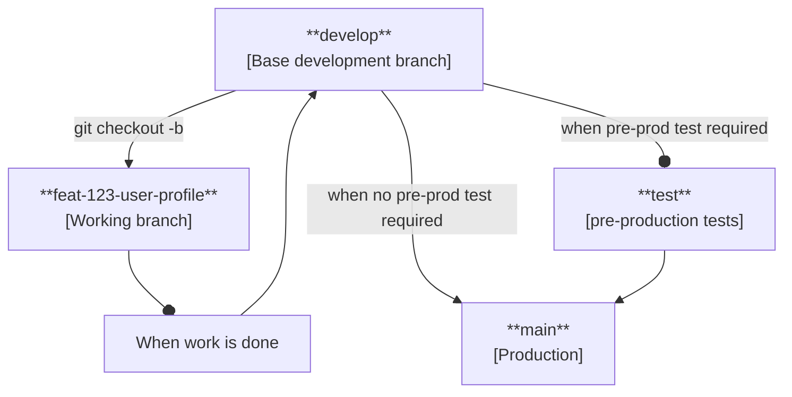

# How to Contribute

## :scroll: OSS Contribution Guide - How to Contribute

Created by: Roberto "Andler" Lucas Created time: January 7, 2025 12:17 AM Tags: Engineering, Guides, Product

Welcome to KindFi! We're excited to have you as a part of our community. Here's what you need to know as a contributor:

1. **Onboarding:** All new contributors are required to go through our onboarding process, which includes:
   * Reading and acknowledging our contributor guidelines and code of conduct.
   * Acknowledge maintainers/admins that you have read the given documentation and you have applied to your first issue in the Telegram community.
2. **Communication:** takes place on our Telegram server. Make sure to join the relevant channels and introduce yourself to the community. Additionally, you can communicate any update at the related issue/PR.&#x20;

> ℹ️ Join to our [Telegram community](https://t.me/+CWeVHOZb5no1NmQx) and follow our onboarding process if you haven't already!

### **Getting Started**

To get started to contribute (after onboarding), ensure to:

* Fill out your contribution application. You may find a template here: [Issue Application Template](issue-application-template.md)
  * If you previously contributed with us, tell us how your skills are related with the issue and a short overview of the approach that you are thinking about with an ETA!
* Look for issues labelled "good first issue" on the KindFi portal at the OD platform if it is your first time.
  * _Make sure it has the OD (OnlyDust) tags on it_.
* **NO** self-assigned issues, wait for maintainers/admins to assign you the issue that you've applied for.
  * If you self-assigned an issue, you may not be eligible for the requested issue. Be mindful with other applicants.
* **HAVE YOUR COMMIT SIGNED FOR EVERY PUSH** _(code contributors)_**.** Any commit that is not authenticated (signed) it will be _rejected_ hence, your work _won't count until_ those commits are signed.
  * You can follow this [GitHub guide here](https://docs.github.com/en/authentication/managing-commit-signature-verification/signing-commits) to know how.
* Look our MVP wireframes and designs! You may find it in [this Figma](https://www.figma.com/design/N6eCxAkGM19hQUGBK9GBJa/KindFi-MVP?node-id=65-26\&t=JX2dj1Qb7iPpJ4AX-11).
  * If you are proposing a design and want to contribute to edit, request access.
* Keep the conversation when you have an assigned issue, we want to know how you are progressing!
  * If have been assigned and no response from the contributor, it may result of assignation destitution and be assigned to someone else or moved to the next round. Be mindful with other applicants and your reputation!

## :woman\_technologist: Code Style and Conventions

To ensure our codebase remains a shining example of consistency and quality, we adhere to a set of coding conventions that will guide you on your quest:

* Harness the power of the Shadcn/ui component library and Tailwind CSS to create stunning, responsive UIs.
* Embrace the declarative paradigm and leverage the magic of React hooks for building modular, reusable components.
* Wield the power of TypeScript to write code that's self-documenting, catch errors early, and provide an exceptional developer experience.
* Keep your code DRY (Don't Repeat Yourself) to maintain a lean and efficient codebase.
* Craft meaningful, intention-revealing names for your variables, functions, and components.
* Design small, focused components that excel at a single responsibility.
* Embrace a functional architecture style, reserving classes for server workers or controllers.
* Extract logic into separate functions only when it enhances readability or promotes reusability.

Dive into our [**comprehensive code style guide**](../code-and-design-guide-style-and-conventions/) to uncover a wealth of detailed examples and best practices that will elevate your code to new heights!

## :computer: Git Conventions

In this mono-repo, consistency is key to maintaining a clean and organized codebase. These guidelines outline clear conventions for commit messages and branch naming, ensuring a readable and professional commit history that fosters collaboration.

### Branching Model

We adopt a powerful feature branch workflow that will help you organize your contributions effectively:

* Use hyphens to separate words in your branch names (e.g., `feat-user-profile`) for maximum clarity.
* Prefix your branch names with the type of change you're making:
  * `feat-`: Adds new features or capabilities.
  * `fix-`: Resolves bugs or issues.
  * `docs-`: Updates documentation.
  * `style-`: Changes code style (formatting, spacing, etc.).
  * `refactor-`: Improves code structure without changing behavior.
  * `impr-`: Improves performance and/or code structure.
  * `test-`: Adds or modifies tests.
  * `build-`: Changes build system or dependencies.
  * `ci-`: Updates CI/CD configuration.
  * `chore-`: Handles routine maintenance tasks.
* Include the github issue number in your branch name (e.g., `feat-123-user-profile`) to establish a clear link.
* For complex features, use forward slashes to create a meaningful hierarchy (e.g., `feat/user/profile`).
  * This will be uncommon unless we need a version of the repository that requires a heavy workload without affecting the main development process.
* **ALL BRANCHES AND COMMIT MESSAGES MUST BE WRITTEN IN LOWERCASE.**
* Keep commit messages concise and descriptive (under 72 characters for the title).
* Use a monorepo mindset: ensure clarity about which part of the project your changes affect.

By following these conventions, you'll create a well-structured, easily navigable Git history that tells the story of your project's evolution.

### Commit Messages

Write your commit messages as clear, action-oriented statements (e.g.: `feat(api): add user profile app endpoint`) that explain what your changes do:

* `feat:` for adding new features or capabilities.
* `fix:` for resolving bugs and issues.
* `docs:` for updating documentation and guides.
* `style:` for improving code formatting and appearance.
* `refactor:` for improving code structure without changing behavior.
* `test:` for adding or updating tests.
* `chore:` for maintaining build processes and tools.
* `build:` for modifying build system or dependencies.
* `impr:` for improving performance and/or code quality.
* `ci:` for updating CI/CD configuration.
* `wip:` for any work in progress. Additional context is required. e.g.: `wip(feat): add user profile app endpoint`.

> ℹ️ NOTE: when working with monorepos, best way to provide an even further context, we can include the app name that we are working on for a direct connection with the intended work. e.g.: `[web] wip(feat): add user profile app endpoint` or `[indexer] wip(impr): auction count upt`. This work the most for final merges to develop/main branches or work in progress commits.

Feel free to include additional context in the commit body when necessary, referencing any related issues to paint a complete picture of your changes.

### Pull Requests

When you're ready to share your contributions with the world, it's time to create a pull request that showcases your work:

1. Craft a clear, descriptive title that captures the essence of your changes.
2. Highlight the key points of your modifications in the description.
3. Keep your PRs focused and manageable by addressing a single, well-defined task.
4. Assign knowledgeable reviewers (project leads) who are familiar with the area of the codebase you've modified.
5. Don't forget to tests your changes before submitting a PR as ready to review to ensure a smooth integration and PR rejections.

For instance, a PR titled "\[web] Fix login form validation error on Safari" provides a concise summary of the issue being addressed and the app being modified.

## :motorway: Development Process

### Getting Started

Before beginning your development journey, you will have to request access to the repository if you are not able to push changes. Once you have the permissions and everything set, follow these essential steps:

1. Prepare your git signatures! If you haven't set it up yet, follow [this guide](https://docs.github.com/en/authentication/managing-commit-signature-verification/signing-commits).
2. Clone the repository into your local machine with a password-protected SSH key:&#x20;

<pre class="language-bash"><code class="lang-bash"><strong>git clone git@github.com:kindfi-org/kindfi.git
</strong></code></pre>

3. We use **`bun`** package manager. Set up your development environment with `bun install`. Avoid to include any other package manager i.e.: `pnpm`, `yarn`, `npm`.
   1. On each project, there is a `README.md`file that mentions how to boot each app/service and how to use the available scripts for each `package.json`.
   2. Once you have installed all dependencies, make sure that `husky` has been installed for the pre-commits, [commitlintin](https://commitlint.js.org/)[g](https://commitlint.js.org/) and [`biome.js`](https://biomejs.dev/) linting and formatting.
   3. Ask for environment variable credentials when required. You might need them while working in the web app.
      1. For supabase, if you have docker in your machine, you can initialize supabase locally and use those credentials instead.
4. Optionally, for macOS/Linux users, review the root `Taskfile` for available commands and scripts.

### Development Flow

> ⚠️ Always rebase from the `develop` branch. The working flow is:
>
> 1. Create a new branch from `develop` with the issue number and a brief description.
> 2. Work on your feature/fix.
> 3. Rebase from `develop` to keep your branch up-to-date.
> 4. Push your branch to the remote repository.
> 5. Create a pull request to merge your branch into `develop`.
> 6. Assign reviewers and make sure all checks pass.
> 7. Merge your branch into `develop` if project lead approves.

### Making Changes

Follow these best practices while working on your contribution:

1. Create a feature branch: `git checkout -b your-branch-name`
2. Make atomic, focused commits with clear messages
3. Follow our established coding conventions
4. Add comments to explain complex logic

### Testing

While working on an issue, make sure to run local tests to ensure code efficiency and the code works. Otherwise, when raising the PR, it can be rejected and be re-assigned. Justify your test by performing manual testing.

When working on tests, there are 2 kind of ways (and steps):

1. **Unit Tests:** Ensure the quality of a previous or given contribution:
   * Create with prompt engineering with an AI chat tool, the unit tests based on the new features.
   * Run the `bun test` script to check for regressions. Out of the box, `bun` supports unit test, meaning they will hear any `[file_name].test.ts` file where script has been executed.
2. **Perform thorough manual testing:** as is for the developer to test locally, performing this action will assist to confirm that the issue has been resolved as expected. This is for having a 2nd pair of eyes to verify UI/UX and functionality as user, giving a final test report.

### Documentation

Our documentation is organized in the `docs` folder:

* Changelogs tracking project evolution
* Comprehensive guides and tutorials
* Architecture Decision Records (ADRs)
* API documentation
* System architecture overview

Keep documentation current and well-organized as you contribute. If you are contributing in the documentation, **always** provide context about the changes that you are making and why you are making those. Any work with documentation updates and has not been explained in the PR description, it will be rejected.

## :art: Design Process

Our design workflow is centered around Figma and follows a structured process from idealization to implementation:

### Getting Started

Begin your design journey with these steps:

1. Accept your assigned issue in OnlyDust.
2. Request access to our [Figma workspace](https://www.figma.com/files/team/1445297614298403934/project/308829761/KindFi?fuid=1445297612433606627).
3. Review our design system documentation and component library.
4. Set up your Figma workspace with proper file organization.

### Design Workflow

Follow these guidelines while working on your designs:

1. Create designs in the designated Figma project space.
2. Use components from our design system library.
3. Implement auto-layout for responsive designs.
4. Add detailed developer notes in Figma's developer mode.

### Design System Standards

* Follow established component naming conventions as our Code Style and Conventions.
* Use auto-layout for all components to ensure responsive design.
* Maintain a clear component hierarchy and organization.
* Document all design decisions and component usage guidelines within the related issue.

Dive into our [**comprehensive design style guide**](../code-and-design-guide-style-and-conventions/code-and-design-guide-style-and-conventions-1.md) to uncover a wealth of detailed examples and best practices that will elevate your code to new heights!

### Review Process

Ensure your designs meet our quality standards:

* Follow design system guidelines strictly
* Use proper constraints and auto-layout
* Include comprehensive developer handoff notes
* Document component behavior and interactions

### Design Hand-off

Prepare your designs for development:

1. Submit your designs following our Figma organization structure.
   1. You may provide a prototype for an enhanced UX review.
2. Maintainers/admins review for design system compliance and implementation feasibility.
3. Address feedback through Figma comments.
   1. You may receive feedbacks within the issue or PR (if any). Mind to keep the conversation alive.&#x20;
4. Continue iterations until designs meet all requirements.

