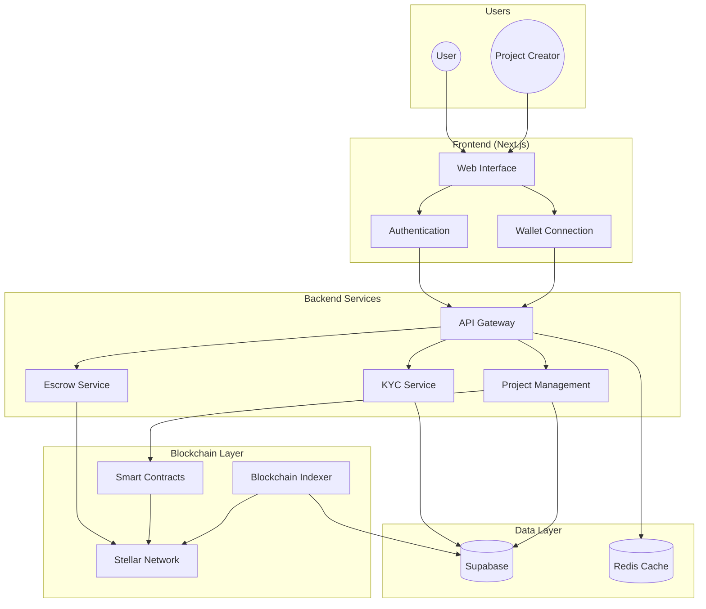
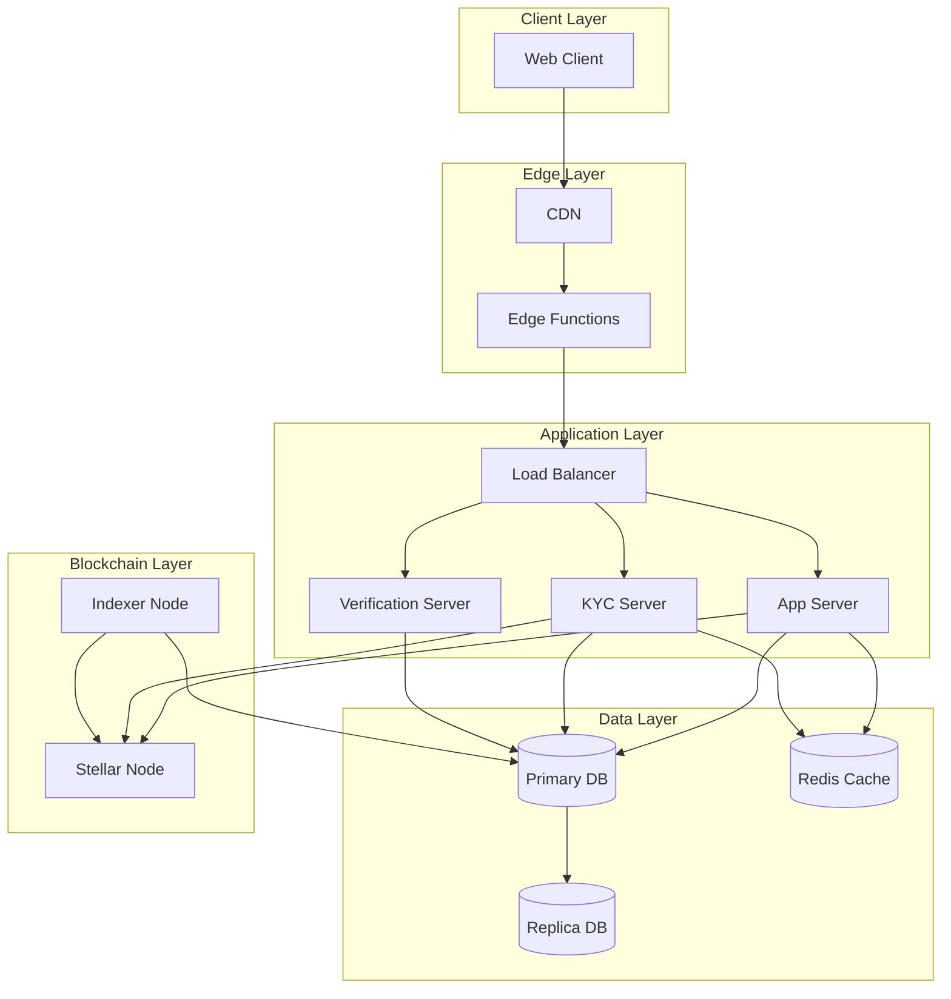

# Project Architecture

## OSS Contribution Guide - Project Architecture

Created by: Roberto "Andler" Lucas Created time: January 7, 2025 12:17 AM Tags: Engineering, Guides, Product

## **Technology Stack - Powering KindFi's Vision**

**KindFi's robust and innovative technology stack is designed to ensure scalability, security, and efficiency while empowering global collaboration**. From blockchain integration to AI-driven tools, each component works seamlessly to deliver a transformative platform for social impact.

### **🚀 Blockchain Integration**

#### **Stellar Blockchain**

* **What is Stellar:** Stellar is a decentralized, fast, and low-cost blockchain for global financial transactions.
* **How KindFi uses it**:
  * **Escrows**: Ensures funds are securely held and released only upon milestone completion.
  * **Low-Cost Transactions**: Enables fast, cost-efficient global payments.
  * **Transparency**: Provides auditable, tamper-proof records for every transaction.
* Documentation: [Stellar Docs](https://developers.stellar.org/docs/learn/fundamentals)

#### **Trustless Work Integration - Blockchain-Powered Escrows**

* **What is Trustless Work:** An "Escrow-as-a-Service" platform that uses blockchain for secure, transparent, and automated transactions. Through smart contracts and stablecoins, it automates the escrow process.
* **How KindFi uses it:**
  * **Automated Fund Management:** Smart contracts hold backers' funds in escrow, releasing them to project creators only when predefined milestones are met.
  * **Enhanced Transparency:** All transactions are recorded on the blockchain, giving backers a clear, tamper-proof record of fund allocation.
  * **Reduced Costs:** Using the Stellar blockchain, Trustless Work provides lower transaction fees than traditional escrow services.
  * **Simplified Integration:** An API lets crowdfunding platforms easily add secure escrow features to their existing systems.
* **Documentation:** [Trustless Work Docs](https://docs.trustlesswork.com/)

#### **Ethereum Compatibility**

* **What is Ethereum:** Ethereum is a decentralized, open-source blockchain with smart contract functionality.
* **How KindFi uses it:**
  * Smart Contracts:
    * KindFi contract Powers NFT rewards and gamification features.
    * Auth contract for user credential and address management, such as backup signers, creation, verification and restoration.
* Documentation: [Ethereum Docs](https://ethereum.org/developers/docs/), [Stellar Multi-Sig Docs](https://developers.stellar.org/docs/learn/encyclopedia/security/signatures-multisig), [Add/Remove Signers](https://coinpixie.com/stellar-add-and-remove-signers/)

#### **Indexing with Subquery Network**

* **What is Subquery:** Is a fast, flexible, and reliable open-source data indexer that provides you with custom APIs for your web3 project across all of our supported networks.
* **How KindFi uses it:**
  * Provides custom APIs for blockchain data, enabling efficient data retrieval and analysis.
  * Ensures fast, reliable, and scalable data indexing for blockchain transactions.
* Documentation: [Subquery Docs](https://academy.subquery.network)

### **🤖 AI Integration**

#### **HuggingFace Models**

* **What is HuggingFace**: HuggingFace is a platform for building, training, and deploying state-of-the-art machine learning models.
* **How KindFi uses it**:
  * Advanced _KYC verification_ and fraud detection.
  * Streamlined data analysis for optimized campaign performance.
* Documentation: [HuggingFace Docs](https://huggingface.co/docs)

#### **Vercel AI SDK**

* **What is Vercel AI SDK:** Vercel AI SDK provides serverless functions for integrating AI capabilities into applications.
* **How KindFi uses it:**
  * AI-driven chat agents to guide users through platform features.
  * Personalized experiences and recommendations for donors and creators.
* Documentation: [Vercel AI SDK Docs](https://sdk.vercel.ai/docs/introduction)

#### **AI-Driven Development (AIDD)**

* **What is AIDD**: AIDD refers to the software development process that uses artificial intelligence.
* **How KindFi uses it:**
  * Accelerates development and learning for contributors.

### **💻 Frontend Technologies**

#### **Next.js**

* **What is Next.js:** Next.js is a React framework for building server-side rendered and static web applications.
* **How KindFi uses it:**
  * Provides a robust, server-side rendering framework for scalable front-end development.
  * Enhances SEO and user experience with dynamic web applications.
* Documentation: [Next.js Docs](https://nextjs.org/docs)

#### **TailwindCSS & shadcn/ui**

* **What is TailwindCSS:** TailwindCSS is a utility-first CSS framework for rapidly building custom user interfaces.
* **What is shadcn/ui:** shadcn/ui provides beautifully designed components built with Radix UI and Tailwind CSS.
* **How KindFi uses them:**
  * Modern, utility-first CSS framework for consistent and responsive design.
  * Streamlines UI development for a seamless user experience.
* Documentation: [TailwindCSS Docs](https://tailwindcss.com/docs), [shadcn/ui Docs](https://ui.shadcn.com/)

#### **Framer Motion**

* **What is Framer Motion:** Framer Motion is a production-ready motion library for React.
* **How KindFi uses it:**
  * Adds rich, interactive animations to enhance user engagement.
* Documentation: [Framer Motion Docs](https://www.framer.com/docs/)

### **🏗️ Backend Technologies**

#### **Node.js & Express.js**

* **What is Node.js:** Node.js is a JavaScript runtime built on Chrome's V8 JavaScript engine.
* **What is Express.js:** Express.js is a fast, unopinionated, minimalist web framework for Node.js.
* **How KindFi uses them:**
  * Powers the backend for lightweight, efficient, and scalable application development.
* Documentation: [Node.js Docs](https://nodejs.org/en/docs/), [Express.js Docs](https://expressjs.com/)

#### **Supabase**

* **What is Supabase:** Supabase is an open-source Firebase alternative providing a real-time database and authentication layer.
* **How KindFi uses it:**
  * Real-time database and authentication layer for secure and scalable operations.
* Documentation: [Supabase Docs](https://supabase.com/docs)

#### **DrizzleORM**

* **What is DrizzleORM:** DrizzleORM is a Typescript ORM for SQL databases.
* **How KindFi uses it:**
  * Simplifies database interactions with type-safe queries and structured access.
  * For shared database access across services, reducing complexity and making the application easier to maintain and extend.
  * Avoids overloading Supabase with requests, ensuring efficient database operations.
* Documentation: [DrizzleORM Docs](https://orm.drizzle.team/docs/overview)

#### **JWT (JSON Web Tokens)**

* **What is JWT:** JWT is a compact URL-safe means of representing claims between two parties.
* **How KindFi uses it:**
  * Secures user sessions and ensures seamless authentication.
  * Token expiration and refresh strategies.
  * Secure storage recommendations.
  * CSRF protection measures.
* Documentation: [JWT Docs](https://jwt.io/introduction)

### **🚨 Authentication**

#### **Passkeys**

* **What are Passkeys:** Passkeys (or WebAuthN in his technical form) is a web standard for creating and using passkeys for authentication, a Web Authentication API for strong authentication with public key cryptography.
* **How KindFi uses them:**
  * Modern, secure authentication methods that eliminate the need for traditional passwords.
  * Enables biometric or physical key access for a frictionless login experience and transaction signature security.
  * Provides an enhanced security to protect user data.
  * Streamlined Web3 wallet integration for non-crypto and crypto users alike.
* Documentation: [WebAuthn Guide](https://developer.mozilla.org/en-US/docs/Web/API/Web_Authentication_API), [WebAuthn Docs](https://webauthn.io/).

**Passkey (WebAuthN) Browser Support**

Passkeys are supported in all major modern browsers. For desktop, Chrome 67+, Firefox 60+, Safari 13+, and Edge 79+ offer full support. On mobile, Android 7+ (Chrome), iOS 13+ (Safari), and Firefox 98+ provide comprehensive support. For detailed compatibility information, visit [Can I use... WebAuthn](https://caniuse.com/webauthn).

| Browser         | Desktop Support | Mobile Support |
| --------------- | --------------- | -------------- |
| Chrome          | 67+             | Android 7+     |
| Firefox         | 60+             | 98+            |
| Safari          | 13+             | iOS 13+        |
| Edge (Chromium) | 79+             | 79+            |
| Opera           | 54+             | 73+            |

### **🪙 Payment and Onboarding**

#### **OnRamper**

* **What is OnRamper:** OnRamper is a fiat on-ramp aggregator for seamless crypto purchases.
* **How KindFi uses it:**
  * Simplifies fiat-to-crypto conversions for easy onboarding.
  * Reduces barriers for non-crypto users to participate in Web3 projects.
* Documentation: [OnRamper Docs](https://docs.onramper.com/)

### **🧰 Developer Tools**

#### **GitHub & GitOps**

* **What is GitHub:** GitHub is a web-based version control and collaboration platform for software development.
* **What is GitOps:** GitOps is an operational framework that takes DevOps best practices used for application development.
* **How KindFi uses them:**
  * Centralized code management for collaborative development and streamlined workflows.
* Documentation: [GitHub Docs](https://docs.github.com/), [GitOps Guide](https://www.gitops.tech/)

#### **Continuous Integration/Continuous Deployment (CI/CD)**

* **What is CI/CD**: CI/CD refers to automated testing and deployment pipelines for high-quality code releases.
* **How KindFi uses it:**
  * Ensures reliable and efficient code deployment and management.

### **🐰 CodeRabbit**

* **What is CodeRabbit:** CodeRabbit is a GitHub app for automated code reviews and quality checks.
* **How KindFi uses it:**
  * Ensures code quality and adherence to best practices through automated checks.
* Documentation: [CodeRabbit GitHub App](https://docs.coderabbit.ai/?_gl=1*1i6z1sg*_gcl_aw*R0NMLjE3MzM0MTgyMTguQ2owS0NRaUF1OFc2QmhDLUFSSXNBQ0VRb0RDRWs0cmpZMTZLWkhHdTAtbU1kVjVkdXhjcHpSX0RqWXB2WUxxVlpYMHJ4ODM3S1RKVENGMGFBcjZwRUFMd193Y0I.*_gcl_au*MTAwODQzNTkzOS4xNzMwOTkxMDU0)

### **🧠 Smart Contracts**

#### **Stellar-Based Contracts**

* **What are Stellar-Based Contracts:** Stellar-based contracts are smart contracts that run on the Stellar blockchain.
* **How KindFi uses them:**
  * Powers escrow systems and ensures milestone-based fund releases.
* Documentation: [Stellar Smart Contracts](https://developers.stellar.org/docs/smart-contracts)

#### **Ethereum Smart Contracts**

* **What are Ethereum Smart Contracts:** Ethereum smart contracts are self-executing contracts with the terms of the agreement directly written into code.
* **How KindFi uses them:**
  * Supports gamification elements like NFT-based rewards.
* Documentation: [Ethereum Smart Contracts](https://ethereum.org/en/developers/docs/smart-contracts/)

#### **The Power of KindFi's Tech Stack**

By combining cutting-edge technologies with a purpose-driven design, _**KindFi's tech stack creates a platform that's scalable, secure, and inclusive**_. It's not just about what we're building—it's about how we're empowering communities, developers, and innovators to drive meaningful change.

### :open\_file\_folder: Folder Structure

Our monorepo, managed with the lightning-fast `bun` package manager, follows an intuitive and declarative folder structure:

1. `apps/`: The home for your groundbreaking server and web applications
2. `packages/`: A treasure trove of reusable packages that your apps and services can leverage
3. `services/`: The hub for integrating powerful third-party services like Supabase and DatoCMS
4. `docs/`: The knowledge base where we store enlightening markdown documents, from product updates to architectural decisions

The beauty of this structure lies in its modularity and flexibility:

* Services can seamlessly integrate packages to supercharge their functionality
* Apps can tap into the power of both packages and services to create incredible experiences
* Packages act as the building blocks, independent of specific apps or services
* Docs serve as the source of truth, generating comprehensive external documentation

### :motorway: KindFi Flows

#### KYC System Flow

```mermaid
stateDiagram-v2
    [*] --> PasskeyCheck

    state PasskeyCheck {
        [*] --> CheckBrowserSupport
        CheckBrowserSupport --> CreatePasskey: Supported
        CheckBrowserSupport --> UnsupportedBrowser: Not Supported
        
        CreatePasskey --> PasskeyCreated: Success
        CreatePasskey --> PasskeyError: Failed
        
        PasskeyError --> RetryPasskey
        RetryPasskey --> CreatePasskey
        
        UnsupportedBrowser --> [*]
    }

    PasskeyCheck --> UserRegistration: PasskeyCreated
    
    state UserRegistration {
        [*] --> PrepareWeb3Account
        PrepareWeb3Account --> CollectBasicInfo
        CollectBasicInfo --> [*]
    }

    UserRegistration --> DocumentUpload: Basic Info Provided
    DocumentUpload --> AIVerification: Documents Uploaded

    state AIVerification {
        [*] --> DocumentCheck
        DocumentCheck --> FaceCheck: Success
        DocumentCheck --> VerificationError: Failed
        
        FaceCheck --> LivenessCheck: Success
        FaceCheck --> VerificationError: Failed
        
        LivenessCheck --> [*]: Success
        LivenessCheck --> VerificationError: Failed
        
        VerificationError --> RetryVerification
        RetryVerification --> [*]
    }

    AIVerification --> ManualReview: AI Verification Complete
    AIVerification --> DocumentUpload: Verification Failed

    state ManualReview {
        [*] --> ReviewQueue
        ReviewQueue --> ReviewInProgress: Assigned
        ReviewInProgress --> ReviewComplete: Processed
        ReviewComplete --> [*]
        
        ReviewInProgress --> TimeoutError: Timeout
        TimeoutError --> ReviewQueue: Requeue
    }

    ManualReview --> Approved: Passes Review
    ManualReview --> Rejected: Fails Review
    ManualReview --> DocumentUpload: Additional Docs Needed

    Approved --> KYCComplete
    Rejected --> [*]

    state KYCComplete {
        [*] --> GenerateWeb3Account
        GenerateWeb3Account --> BasicTier: Account Created
        BasicTier --> AdvancedTier: Additional Verification
    }

```

#### App Data Flow

#### Server Data Flow

<pre class="language-mermaid" data-full-width="false"><code class="lang-mermaid"><strong>flowchart TD
</strong>    subgraph Input["Data Input"]
        U[User Data]
        P[Project Data]
        T[Transaction Data]
    end

    subgraph Processing["Data Processing"]
        direction TB
        V[Validation Layer]
        E[Enrichment Layer]
        T1[Transform Layer]
    end

    subgraph Storage["Data Storage"]
        direction TB
        OnChain[On-Chain Storage]
        OffChain[Off-Chain Storage]
        Cache[Cache Layer]
    end

    subgraph Output["Data Output"]
        API[API Responses]
        Events[Event Streams]
        Analytics[Analytics Data]
    end

    U --> V
    P --> V
    T --> V
    V --> E
    E --> T1
    T1 --> OnChain
    T1 --> OffChain
    T1 --> Cache

    OnChain --> API
    OffChain --> API
    Cache --> API

    OnChain --> Events
    OffChain --> Analytics
</code></pre>

#### Network Topology

