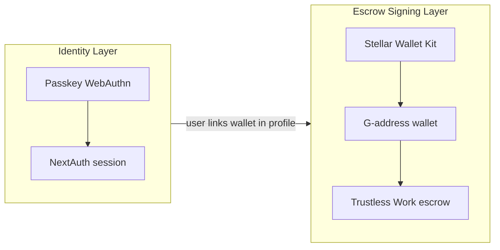

# Smart Account Suspension on Mainnet

This document explains why KindFi suspended Smart Account (C-address) flows for the Mainnet production release, what runs in production instead, and how the preserved implementation can be re-enabled later.

For module-level technical detail (file map, interfaces, API guards), see [`apps/web/lib/smart-account/README.md`](../apps/web/lib/smart-account/README.md).

---

## Summary

| Topic | Status |
|-------|--------|
| Smart Account (C-address) on Mainnet | **Suspended** |
| Smart Account auth contracts on Mainnet | **Not deployed** |
| Passkey login (WebAuthn + NextAuth) | **Production — active** |
| Stellar Wallet Kit (G-address) for escrow | **Production — active** |
| Trustless Work milestone escrow | **Production — active (G-address signing only)** |

**Feature flag (production default):**

```env
NEXT_PUBLIC_ENABLE_SMART_ACCOUNT_CREATION=false
```

Leave this `false` (or unset) on Mainnet until Trustless Work supports C-address signing.

---

## Why Smart Accounts Are Suspended

KindFi built and validated a full Smart Account flow on **Testnet**:

- Passkey-secured Soroban smart wallets (C-addresses)
- Server-side deployment via KindFi auth factory contracts
- WebAuthn-signed transfers and contract calls
- Integration scaffolding for OpenZeppelin `smart-account-kit`

During **Mainnet** integration we hit a blocking ecosystem limitation:

> **Trustless Work does not support transaction signing through Smart Account Kit using C-addresses.**

Trustless Work powers KindFi’s milestone-based escrow (project funding, releases, disputes). Escrow operations require a wallet that can sign the unsigned transactions Trustless Work returns. Today that path only works reliably with **classic Stellar accounts (G-addresses)** connected through **Stellar Wallet Kit** (Freighter, xBull, etc.).

Smart Account C-addresses cannot sign those escrow transactions yet. Shipping Smart Accounts on Mainnet without escrow compatibility would break core crowdfunding flows.

Suspending Smart Accounts for the production release is a **reliability decision**, not a rollback of engineering work. The implementation remains in the codebase behind a feature flag and isolated module boundaries.

---

## What Runs in Production Instead

Production uses a **two-layer wallet model**: identity vs. on-chain escrow signing.



### 1. Passkey authentication (login)

Users sign in and register with **WebAuthn passkeys**. This is the production identity layer.

- Hooks: `usePasskeyAuth`, `usePasskeyRegistration`
- API: `/api/passkey/*`
- Session: NextAuth credentials provider

Passkey auth is **not** suspended. Only optional C-address deployment at registration is disabled.

When Smart Account creation is off, new credentials store a placeholder address (`0x`) on the device record instead of a deployed C-address.

### 2. Stellar Wallet Kit (G-address) for transactions

For escrow and other Trustless Work operations, users connect an **external Stellar wallet** (G-address):

- Provider: `WalletProvider` / `useWallet()` in `use-stellar-wallet.context.tsx`
- Signing: `useTrustlessSigner` → `StellarWalletsKit.signTransaction`
- Profile: external wallet synced via `/api/profile/wallet`

This is the **required** signing path for donations, escrow deploy/fund, milestone releases, and related flows on Mainnet.

### 3. Trustless Work escrow

Escrow logic is unchanged. The app proxies Trustless Work through `/api/trustless-work` and validates that the connected signer is a **G-address**. C-addresses are explicitly rejected at connect time and in escrow signing helpers.

---

## What Was Preserved (Not Deleted)

Smart Account work was **extracted into dedicated modules** so it can be re-enabled with minimal changes when Trustless Work adds C-address support.

| Area | Location |
|------|----------|
| Shared types, feature flag, deployer | `packages/lib/src/smart-account/` |
| Web app module (kit, txs, guards) | `apps/web/lib/smart-account/` |
| Trustless Work compatibility blockers | `apps/web/lib/smart-account/integrations/trustless-work.compat.ts` |
| Deprecated import shims (one release cycle) | `apps/web/lib/stellar/smart-*` re-exports |

### Gated entry points

When the feature flag is off:

- Registration does **not** deploy a C-address
- `/api/stellar/transfer/prepare` and `/api/stellar/transfer/submit` return **403**
- `/api/stellar/account-info`, `/api/stellar/contract/invoke`, balances, and NFT routes for C-addresses return **403**
- UI hides the Smart Account section on profile and header menus
- `useStellarSorobanAccount` no-ops

When the flag is on (testnet development only), the full Smart Account lifecycle remains available for validation.

---

## Business and Product Impact

| User-facing capability | Mainnet today |
|------------------------|---------------|
| Passwordless login with passkey | Yes |
| Create and manage projects | Yes |
| KYC / profile | Yes |
| Connect Freighter / xBull / etc. | Yes |
| Donate and fund escrow | Yes (G-address) |
| NFTs and gamification | Yes (G-address) |
| Milestone releases via Trustless Work | Yes (G-address) |
| On-chain Smart Account (C-address) in profile | No (suspended) |
| Passkey-signed Soroban transfers without external wallet | No (suspended) |

Users should connect an external wallet for any action that moves funds on-chain through escrow.

---

## Environment Configuration

Production Mainnet:

```env
# Must remain false on Mainnet production
NEXT_PUBLIC_ENABLE_SMART_ACCOUNT_CREATION=false
```

Testnet / internal validation (optional):

```env
NEXT_PUBLIC_ENABLE_SMART_ACCOUNT_CREATION=true
# Plus factory contracts, funding key, RPC, etc. — see apps/web/.env.local.example
```

See [`apps/web/.env.local.example`](../apps/web/.env.local.example) for the full variable list.

---

## Re-enabling Smart Accounts (Future)

Re-enable only after **all** of the following are true:

1. Trustless Work documents and ships support for Smart Account Kit / C-address signing (or an equivalent escrow signing path).
2. KindFi auth contracts are deployed on Mainnet (`apps/contract/DEPLOYMENT_MAINNET.md`).
3. Testnet E2E passes: registration → C-address → escrow fund/release with C-address signer.
4. `trustless-work.compat.ts` is updated to allow C-addresses where appropriate.
5. Feature flag is enabled in staging, then Mainnet, with monitoring.

Detailed engineering checklist: [`apps/web/lib/smart-account/README.md`](../apps/web/lib/smart-account/README.md#re-enable-checklist).

---

## Related Documentation

- [Smart Account module README](../apps/web/lib/smart-account/README.md) — architecture, interfaces, integration points
- [AGENTS.md](../AGENTS.md) — agent/developer rules for wallet boundaries
- [KindFi architecture (GitBook)](https://kindfis-organization.gitbook.io/development/kindfi-architecture) — broader system overview

---

## FAQ

**Did we remove Smart Account code?**  
No. It lives under `smart-account/` modules and is disabled via feature flag and API guards.

**Can users still use passkeys?**  
Yes. Passkey authentication is the production login method.

**Why do users need Freighter (or similar) on Mainnet?**  
Trustless Work escrow requires G-address signing. Passkeys handle app login; the external wallet handles on-chain escrow signatures.

**Was Testnet Smart Account work wasted?**  
No. The flow was validated end-to-end on Testnet and is preserved for a future release when the Trustless Work ecosystem supports C-address escrow signing.

**Who do I ask about re-enabling?**  
Coordinate with engineering leads on Trustless Work roadmap updates, Mainnet contract deployment, and the re-enable checklist in the module README.
